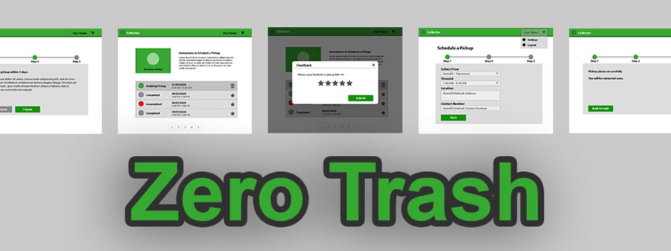

    

# Project Zero Trash

## Team
-  E/15/140, Jaliyagoda A.J.N.M., [nuwanjaliyagoda@eng.pdn.ac.lk](mailto:nuwanjaliyagoda@eng.pdn.ac.lk)
-  E/15/173, Karunarathne S.D.D.D, [dinelkadilshani95@gmail.com](mailto:dinelkadilshani95@gmail.com)
-  E/15/350, Tennakoon T.M.P.B., [pasan96tennakoon@gmail.com](mailto:pasan96tennakoon@gmail.com)

## Table of Contents
1. [Introduction](#introduction)
2. [Solution Architecture](#solution-architecture )
3. [Design](#design)
4. [Deployments](#deployments)
5. [Testing](#testing)
6. [Links](#links)

---

## Introduction

In today’s increasingly congested world, it is difficult to imagine the absence of waste. Waste generation levels are rising. In 2019 alone, the world’s cities produced 2 billion tons of solid waste. With increasing urbanization and population growth, annual waste generation is expected to grow by 70% in 2050.

Although richer nations like the U.S.A and Japan produce more waste than countries like Sri Lanka, the problems of waste management are different in the developing world. Unlike developed nations, we do not have a well-organized means of controlling waste. Garbage is rarely collected on a regular basis, as municipalities are often underfunded. The lack of status and poor salaries associated with the job of garbage collection also creates a system where employees are not trained or able to manage an effective system.

Zero Trash provides a communication platform between its users and garbage collectors which did not exist (at least not successfully) in Sri Lanka. This could have huge implications for both lessening the cost of collecting garbage and aiding in the recycling process, as well as ensuring that materials that would otherwise end up in a landfill are transported to the appropriate recycling centers. This will increase the income for garbage collectors while providing householders with an additional income.

## Solution Architecture

### Frontend Web Applications for Clients
For Users and Collectors. Users should be able to sign in to it and place pickup requests for trash collections and maintain their contact information.

### RESTful API Server
This will provide data and services to the Frontend application using HTTP GET and POST requests. Every request is authenticated using a bearer authentication token, which is issued to users when login into the system.

### Web Application for Management
For management and monitoring purposes. System owners can sign in and see the progress of the system, accept and manage trash collector activities, communicate with customers, and see the summary of trash collected between certain periods.

## Design

ER Diagram:

A User Case Diagram:

## Deployments

Frontend component is based on client side processing and it can be stored as a static web page on a server. React framework provides an option for build and develop the content using Development mode and after the component is ready for Deployment, it allows to collect all the HTML, JS and CSS files, bundle them and export the site as a package for Live Production.

We used git with Github for development and it allows build workflows for automation of the project deployment. So we used the Workflow for React applications and once a pull request or commit happens to the master branch, it can automatically build the code for the production environment.

Since we have not commercialized our project yet, we used the feature provided by GitHub for static web page hosts, named GitHub Pages. Our workflow can automatically upload the latest production build into the GitHub page we have created. This will help us to follow the DevOps practice known as CI/CD

## Testing

Unit Testing was mainly focused on front end web application which is exposed to the customers. Unit tests were done using Jest and Enzyme libraries. Following areas were considered when writing unit tests

- Object Rendering
- API endpoint handling
- Styling
- Input validation with states
- Transferring of props

## Links

- [Project Repository](https://github.com/cepdnaclk/e15-co328-zero-trash)
- [Project Report](https://cepdnaclk.github.io/e15-co328-zero-trash/report.pdf)

- [Department of Computer Engineering](http://www.ce.pdn.ac.lk/)
- [University of Peradeniya](https://eng.pdn.ac.lk/)

[//]: # (Please refer this to learn more about Markdown syntax)
[//]: # (https://github.com/adam-p/markdown-here/wiki/Markdown-Cheatsheet)
